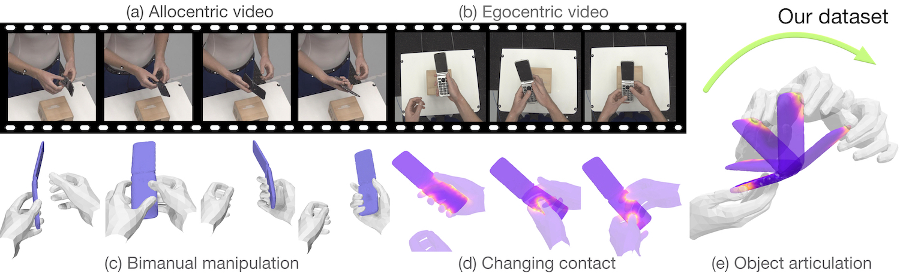

## ARCTIC 🥶: A Dataset for Dexterous Bimanual Hand-Object Manipulation

<p align="center">
    
</p>

[ [Project Page](https://arctic.is.tue.mpg.de) ][ [Paper](https://download.is.tue.mpg.de/arctic/arctic_april_24.pdf) ][ [Video](https://www.youtube.com/watch?v=bvMm8gfFbZ8) ] [[Register ARCTIC Account]](https://arctic.is.tue.mpg.de/register.php) | [[Competition](https://sites.google.com/view/hands2023/home)]


<p align="center">    
    
</p>


This is a repository for preprocessing, splitting, visualizing, and rendering (RGB, depth, segmentation masks) the ARCTIC dataset.
Further, here, we provide code to reproduce our baseline models in our CVPR 2023 paper (Vancouver, British Columbia 🇨🇦) and developing custom models.

Our dataset contains heavily dexterous motion:

<p align="center">
    
</p>

### Why use ARCTIC?

Summary on dataset:
- It contains 2.1M high-resolution images paired with annotated frames, enabling large-scale machine learning.
- Images are from 8x 3rd-person views and 1x egocentric view (for mixed-reality setting).
- It includes 3D groundtruth for SMPL-X, MANO, articulated objects.
- It is captured in a MoCap setup using 54 high-end Vicon cameras.
- It features highly dexterous bimanual manipulation motion (beyond quasi-static grasping).

Potential tasks with ARCTIC:
- Generating [hand grasp](https://korrawe.github.io/HALO/HALO.html) or [motion](https://github.com/cghezhang/ManipNet) with articulated objects
- Generating [full-body grasp](https://grab.is.tue.mpg.de/) or [motion](https://goal.is.tue.mpg.de/) with articulated objects
- Benchmarking performance of articulated object pose estimators from [depth images](https://articulated-pose.github.io/) with human in the scene
- Studying our [NEW tasks](https://download.is.tue.mpg.de/arctic/arctic_april_24.pdf) of consistent motion reconstruction and interaction field estimation
- Studying egocentric hand-object reconstruction
- Reconstructing [full-body with hands and articulated objects](https://3dlg-hcvc.github.io/3dhoi/) from RGB images


Check out our [project page](https://arctic.is.tue.mpg.de) for more details.

### News

- 2023.06.16: ICCV ARCTIC [challenge](https://sites.google.com/view/hands2023/home) starts!
- 2023.05.04: ARCTIC dataset with code for dataloaders, visualizers, models is officially announced (version 1.0)! 
- 2023.03.25: ARCTIC ☃️ dataset (version 0.1) is available! 🎉

Invited talks/posters at CVPR2023:
- [4D-HOI workshop: Keynote](https://4dhoi.github.io/)
- [Ego4D + EPIC workshop: Oral presentation](https://ego4d-data.org/workshops/cvpr23)
- [Rhobin workshop: Poster](https://rhobin-challenge.github.io/schedule.html)
- [3D scene understanding: Oral presentation](https://scene-understanding.com)

### Features

<p align="center">
    
</p>

- Instructions to download the ARCTIC dataset.
- Scripts to process our dataset and to build data splits.
- Rendering scripts to render our 3D data into RGB, depth, and segmentation masks.
- A viewer to interact with our dataset.
- Instructions to setup data, code, and environment to train our baselines.
- A generalized codebase to train, visualize and evaluate the results of ArcticNet and InterField for the ARCTIC benchmark.
- A viewer to interact with the prediction.

TODOs:

- [ ] Add more documentation to code
- [ ] Utils to upload test set results to our evaluation server
- [ ] Clean code further


### Getting started

Get a copy of the code:
```bash
git clone https://github.com/zc-alexfan/arctic.git
```

- Setup environment: see [`docs/setup.md`](docs/setup.md)
- Download and visualize ARCTIC dataset: see [`docs/data/README.md`](docs/data/README.md)
- Training, evaluating for our ARCTIC baselines: see [`docs/model/README.md`](docs/model/README.md).
- FAQ: see [`docs/faq.md`](docs/faq.md)

### License

See [LICENSE](LICENSE).

### Citation

```bibtex
@inproceedings{fan2023arctic,
  title = {{ARCTIC}: A Dataset for Dexterous Bimanual Hand-Object Manipulation},
  author = {Fan, Zicong and Taheri, Omid and Tzionas, Dimitrios and Kocabas, Muhammed and Kaufmann, Manuel and Black, Michael J. and Hilliges, Otmar},
  booktitle = {Proceedings IEEE Conference on Computer Vision and Pattern Recognition (CVPR)},
  year = {2023}
}
```

Our paper benefits a lot from [aitviewer](https://github.com/eth-ait/aitviewer). If you find our viewer useful, to appreciate their hard work, consider citing:

```bibtex
@software{kaufmann_vechev_aitviewer_2022,
  author = {Kaufmann, Manuel and Vechev, Velko and Mylonopoulos, Dario},
  doi = {10.5281/zenodo.1234},
  month = {7},
  title = {{aitviewer}},
  url = {https://github.com/eth-ait/aitviewer},
  year = {2022}
}
```

### Acknowledgments

Constructing the ARCTIC dataset is a huge effort. The authors deeply thank: [Tsvetelina Alexiadis (TA)](https://ps.is.mpg.de/person/talexiadis) for trial coordination; [Markus Höschle (MH)](https://ps.is.mpg.de/person/mhoeschle), [Senya Polikovsky](https://is.mpg.de/person/senya), [Matvey Safroshkin](https://is.mpg.de/person/msafroshkin), [Tobias Bauch (TB)](https://www.linkedin.com/in/tobiasbauch/?originalSubdomain=de) for the capture setup; MH, TA and [Galina Henz](https://ps.is.mpg.de/person/ghenz) for data capture; [Priyanka Patel](https://ps.is.mpg.de/person/ppatel) for alignment; [Giorgio Becherini](https://ps.is.mpg.de/person/gbecherini) and [Nima Ghorbani](https://nghorbani.github.io/) for MoSh++; [Leyre Sánchez Vinuela](https://is.mpg.de/person/lsanchez), [Andres Camilo Mendoza Patino](https://ps.is.mpg.de/person/acmendoza), [Mustafa Alperen Ekinci](https://ps.is.mpg.de/person/mekinci) for data cleaning; TB for Vicon support; MH and [Jakob Reinhardt](https://ps.is.mpg.de/person/jreinhardt) for object scanning; [Taylor McConnell](https://ps.is.mpg.de/person/tmcconnell) for Vicon support, and data cleaning coordination; [Benjamin Pellkofer](https://ps.is.mpg.de/person/bpellkofer) for IT/web support; [Neelay Shah](https://ps.is.mpg.de/person/nshah), [Jean-Claude Passy](https://is.mpg.de/person/jpassy), [Valkyrie Felso](https://is.mpg.de/person/vfelso) for evaluation server. We also thank [Adrian Spurr](https://ait.ethz.ch/people/spurra/) and [Xu Chen](https://ait.ethz.ch/people/xu/) for insightful discussion. OT and DT were supported by the German Federal Ministry of Education and Research (BMBF): Tübingen AI Center, FKZ: 01IS18039B".


### Contact

For technical questions, please create an issue. For other questions, please contact `arctic@tue.mpg.de`.

For commercial licensing, please contact `ps-licensing@tue.mpg.de`.
