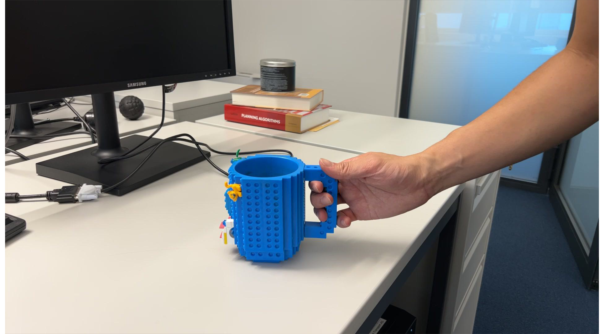

# ARCTIC dataset

> ✨CVPR 2024 Highlight: HOLD is the first method that jointly reconstructs articulated hands and objects from monocular videos without assuming a pre-scanned object template and 3D hand-object training data. See our [project page](https://github.com/zc-alexfan/hold) for details.
>
> <p align="center">
>      <!-- Adjust width as needed -->
> </p>
>
> <p align="center">
>      <!-- Adjust width as needed -->
> </p>


## Table of content

- [Overview](#overview)
- [Sanity check](#sanity-check-on-the-data-pipeline)
- [Download full ARCTIC](#download-full-arctic)
- [Data documentation](data_doc.md)
- [Data preprocessing and splitting](processing.md)
- [Data visualization](visualize.md)

## Overview

So far ARCTIC provides the following data and models:
- `arctic_data/data/images [649G]`: Full 2K-resolution images
- `arctic_data/data/cropped_images [116G]`: loosely cropped version of the original images around the object center for fast image loading
- `arctic_data/data/raw_seqs [215M]`: raw GT sequences in world coordinate (e.g., MANO, SMPLX parameters, egocentric camera trajectory, object poses)
- `arctic_data/data/splits [18G]`: splits created by aggregating processed sequences together based on the requirement of a specific split.
- `arctic_data/data/feat [14G]`: validation set image features needed for LSTM models.
- `arctic_data/data/splits_json [40K]`: json files to define the splits
- `meta [91M]`: camera parameters, object info, subject info, subject personalized vtemplates, object templates.
- `arctic_data/model [6G]`: weights of our CVPR baselines, and the same baseline models re-trained after upgrading dependencies.

See [`data_doc.md`](./data_doc.md) for an explanation of the data you will download, how the files are related to each others, and details on each file type.

## Sanity check on the data pipeline

This section provides instructions on downloading a mini-version of ARCTIC to test out the downloading, post-processing, and visualization pipeline before downloading the entire dataset.

⚠️ Register accounts on [ARCTIC](https://arctic.is.tue.mpg.de/register.php), [SMPL-X](https://smpl-x.is.tue.mpg.de/), and [MANO](https://mano.is.tue.mpg.de/), and then export your the username and password with the following commands:

```bash
export ARCTIC_USERNAME=<ENTER_YOUR_ARCTIC_EMAIL>
export ARCTIC_PASSWORD=<ENTER_YOUR_ARCTIC_PASSWD>
export SMPLX_USERNAME=<ENTER_YOUR_SMPLX_EMAIL>
export SMPLX_PASSWORD=<ENTER_YOUR_ARCTIC_PASSWD>
export MANO_USERNAME=<ENTER_YOUR_MANO_EMAIL>
export MANO_PASSWORD=<ENTER_YOUR_ARCTIC_PASSWD>
```

Before starting, check if your credentials are exported correctly (following the commands above).

```bash
echo $ARCTIC_USERNAME
echo $ARCTIC_PASSWORD
echo $SMPLX_USERNAME
echo $SMPLX_PASSWORD
echo $MANO_USERNAME
echo $MANO_PASSWORD
```

⚠️ If the echo is empty, `export` your credentials following the instructions above before moving forward.

Dry run the download to make sure nothing breaks:

```bash
chmod +x ./bash/*.sh
./bash/download_dry_run.sh 
python scripts_data/unzip_download.py # unzip downloaded data
python scripts_data/checksum.py # verify checksums
```

After running the above, you should expect:

```
➜ ls unpack/arctic_data/data 
cropped_images  images  meta  raw_seqs  splits_json
```

If this unpacked data is what you want at the end, rename it `data` as the code expects the unpacked data is at `./data`:

```bash
mv unpack data
```

To visualize a sequence, you need to:
1. Process the sequence with `--export_verts`
2. Launch `scripts_data/visualizer.py`
3. Hit `<SPACE>` on your keyboard to play the animation.

```bash
# process a specific seq; exporting the vertices for visualization
python scripts_data/process_seqs.py --mano_p ./data/arctic_data/data/raw_seqs/s01/capsulemachine_use_01.mano.npy --export_verts
python scripts_data/visualizer.py --seq_p ./outputs/processed_verts/seqs/s01/capsulemachine_use_01.npy --object --mano
```


Our `scripts_data/visualizer.py` supports the following features (see [`visualize.md`](visualize.md)):
- Select entities to include in the viewer (MANO/SMPL-X/object/images)
- Interactive mode vs. headless rendering mode
- Render segmentation masks, depth and GT overlaied on videos.

## Download full ARCTIC

Depending on your usage of the dataset, we suggest different download protocols. Choose the sections below that suits your needs.

Before starting, check if your credentials are exported correctly (following the commands above).

```bash
echo $ARCTIC_USERNAME
echo $ARCTIC_PASSWORD
echo $SMPLX_USERNAME
echo $SMPLX_PASSWORD
echo $MANO_USERNAME
echo $MANO_PASSWORD
```

⚠️ If the echo is empty, `export` your credentials following the instructions above before moving forward.

Also gives execution piviliage for the scripts:
```bash
chmod +x ./bash/*.sh 
```

### Using the same splits as our CVPR baselines

This is for people who want to have follow-up work to compare with our ARCTIC baselines. We provide pre-processed data and the same splits in the paper. That is, you don't need to preprocess the data yourself.

```bash
./bash/clean_downloads.sh
./bash/download_body_models.sh
./bash/download_cropped_images.sh
./bash/download_splits.sh
./bash/download_misc.sh
./bash/download_baselines.sh # (optional) weights of our pre-trained CVPR baselines
./bash/download_feat.sh # (optional) images features being used by the pre-trained CVPR LSTM baselines
python scripts_data/checksum.py # verify checksums; this could take a while
python scripts_data/unzip_download.py # unzip downloaded data
```

### Having full control on ARCTIC dataset

This section is what you need if one of the following applies to you:
- You have custom usage such as having a different way to preprocess the data, having different splits, having access to the full resolution images.
- You want a hard copy for the entire dataset (run all the following commands).

If you do not need images (say, you want to study human motion generation), you can skip the "optional" part. However, we suggest to download all data to save youself from headaches.

Clean download cache:
```bash
./bash/clean_downloads.sh
```

Download "smaller" files (required):

```bash
./bash/download_body_models.sh
./bash/download_misc.sh
```

Download cropped images (optional):

```bash
./bash/download_cropped_images.sh
```

Download full-resolution images (optional):

⚠️ If you just want to train and compete with our CVPR models, you only need the cropped images above. The script below download the full-resolution images which can take a while.

```bash
./bash/download_images.sh
```

Download pre-processed splits (optional):

```bash
./bash/download_splits.sh
```

Download image features used by our CVPR LSTM models (optional):

```bash
./bash/download_feat.sh
```

Download our pre-trained CVPR model weights (optional):

```bash
./bash/download_baselines.sh
```

Download MoCap related data (optional):

```bash
./bash/download_mocap.sh
```

After downloading what you need, you can now verify the checksum for corruption, and unzip them all:

```bash
python scripts_data/checksum.py # verify checksums; this could take a while
python scripts_data/unzip_download.py # unzip downloaded data
```

The raw downloaded data can be found under `downloads`. The unzipped data and models can be found under `unpack`. See [`processing.md`](processing.md) for explanation of how the files are organized and what they represent.


