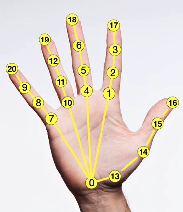

# Data documentation

## Overview

Data processing pipeline (`raw_seqs -> processed_seqs -> splits`): 
- `raw_seqs` provides GT such as MANO/SMPLX parameters in the world coordinate.
- `processed_seqs` is the result of converting GT parameters from `raw_seqs` to data such as MANO joints in individual camera coodinates according to the camera parameters in `meta`.
- `splits` aggregates the `processed_seqs` into training, validation, and test splits. The split is defined by `splits_json` based on sequence names.

Therefore, depending on your end goal, you might not need all the data we provide:
- If your goal to reconstruct hand-object or estimate their dense relative distances as in the same setting of `ArcticNet` and `InterField` baselines in our CVPR paper, we have provided preprocessed data (see [`model/README.md`](../model/README.md)). 
- If your goal is to generate full human or hand motion interacting object, you only need `raw_seqs` and `meta` as they provide SMPLX and MANO GT and the object template. 
- If you want to customize your usage (preprocessing, building custom splits), for custom data processing, one can modify the stage `raw_seqs -> processed_seqs`; For custom splits, one can modify `processed_seqs -> splits` (see advanced usage below).


## Data folder

```
arctic_data/data/: ROOT
arctic_data/data/images/
arctic_data/data/croppped_images/
arctic_data/data/raw_seqs/
    s01/
        *.egocam.dist.npy: egocentric camera poses
        *.mano.npy: MANO parameters
        *.object.npy: object parameters
        *.smplx.npy: SMPLX parameters
    s02/
    ..
    s10/
arctic_data/data/processed_seqs/
arctic_data/data/processed_seqs/s01/
    *.npy: individual processed sequences
arctic_data/data/processed_seqs/s02
..
arctic_data/data/processed_seqs/s10
arctic_data/data/splits/
arctic_data/data/splits_json/
arctic_data/data/meta/
    misc.json: camera parameters, offsets used to sync images and groundtruth, image sizes, subject gender
    object_vtemplates: object templates
    subject_vtemplates: personalized vtemplate for each subject
```

**Object models**

As stated above, object models are stored under the object template directory. Here we detail each file in the object model directory by taking the "box" as an example. 

We have three types of meshes to define the object model: 
- a simplified mesh without texture (used in our cvpr paper for numbers)
    - `mesh.obj`: mesh without texture
    - `parts.json`: each line represent the part of a mesh vertex belong to (1 for top; 0 for bottom)
- two meshes (top and bottom parts of the object) without texture
    - `top.obj`: top part object mesh
    - `bottom.obj`: bottom part object mesh
- a denser mesh with texture
    - `mesh_tex.obj`: textured mesh
    - `material.jpg`: texture map
    - `material.mtl`: texture map

Note that the three types of meshes do not share topology, but they are aligned in the object canonical space such that they overlap to each other.

Others:
- `object_params.json`: define mocap marker locations, 3D bounding box corners, object 3D keypoints used for training (16 keypoints for each part) in the object canonical space
- `top_keypoints_300.json`: 300 keypoints on the top part of object using farthest point sampling
- `bottom_keypoints_300.json`: bottom part

**MoCap data**

Our MoCap release contains three zip files (`mocap_c3d.zip`, `mocap_npy.zip`, `smplx_corres.zip`). The first two are the mocap data, including the marker names and the marker point cloud sequence in c3d format (can be directly viewed via MoCap software such as [Mokka](https://biomechanical-toolkit.github.io/mokka/)) or npy format (can be viewed with AITViewer; see [`[data/visualize.md]`](visualize.md)). `smplx_corres.zip` contains the SMPLX correspondances for the markers. Object marker correspondences can be found in `object_params.json` under each object's vtemplate folder. Note that MoCap marker locations in xyz is in milimeter. 

For the SMPLX correspondances, there are two types of correspondances from MoSH++ (following GRAB): Red markers and blue markers. The blue correspondanes are the SMPLX vertex IDs corresponding to the markers in capture. The red markers are the actual marker locations optimized during stage-1 moshing process. See MoSH++ paper for more details. 

## Model folder

This folder stores the pre-trained models used in our CVPR paper, including their checkpoints and evaluation results (validation set). Each hashcode is the name of the model.

```
arctic_data/models/
```

CVPR paper pre-trained weights: 

|  **EXP**  | **Splits** |    **Method**   |
|:---------:|:----------:|:---------------:|
| 3558f1342 |   P1       |  ArcticNet-SF   |
| 423c6057b |   P1       |  ArcticNet-LSTM |
| 28bf3642f |   P2       |  ArcticNet-SF   |
| 40ae50712 |   P2       |  ArcticNet-LSTM (dropout on) |
| 1f9ac0b15 |   P1       |  InterField-SF  |
| 546c1e997 |   P1       | InterField-LSTM |
| 58e200d16 |   P2       |  InterField-SF  |
| 701a72569 |   P2       | InterField-LSTM |

Weights after code release:

|  **EXP**  | **Splits** |    **Method**   |
|:---------:|:----------:|:---------------:|
| 66417ff6e |   P1       |  ArcticNet-SF   |
| fdc34e6c3 |   P1       |  ArcticNet-LSTM |
| 7d09884c6 |   P2       |  ArcticNet-SF   |
| 49abdaee9 |   P2       |  ArcticNet-LSTM (dropout off) |
| fb59bac27 |   P1       |  InterField-SF  |
| 5e6f6aeb9 |   P1       | InterField-LSTM |
| 782c39821 |   P2       |  InterField-SF  |
| ec90691f8 |   P2       | InterField-LSTM |

The model `40ae50712` is the model in the CVPR paper but it has dropout turned on by mistake. `49abdaee9` is the retrained version with dropout turned off. All other LSTM models are trained without dropout.

## Documentation on file formats

Here we document the details of each field of our dataset. 

File: `'./data/arctic_data/data/raw_seqs/s01/box_grab_01.mano.npy'`

- `s01/box_grab_01` denotes: subject 01 and sequence name `box_grab_01`
- `rot`: MANO global rotation in axis-angle; `frames x 3`
- `pose`: MANO pose parameters in axis-angle; `frames x 45`
- `trans`: MANO global translation; `frames x 3`
- `shape`: MANO shape parameters; `frames x 10`
- `fitting_err`: MANO global rotation; `frames`

File: `'./data/arctic_data/data/raw_seqs/s01/box_grab_01.smplx.npy'`

- `transl`: SMPL-X global translation; `frames x 3`
- `global_orient`: SMPL-X global rotation in axis-angle; `frames x 3`
- `body_pose`: SMPL-X body pose in axis-angle; `frames x 63`
- `jaw_pose`: SMPL-X jaw pose in axis-angle; `frames x 3`
- `leye_pose`: SMPL-X left eye pose in axis-angle; `frames x 3`
- `reye_pose`: SMPL-X right eye pose in axis-angle; `frames x 3`
- `left_hand_pose`: SMPL-X left hand pose in axis-angle; `frames x 45`
- `right_hand_pose`: SMPL-X right hand pose in axis-angle; `frames x 45`

File: `'./data/arctic_data/data/raw_seqs/s01/box_grab_01.egocam.dist.npy'`

- `R_k_cam_np`: Rotation matrix for the egocentric camera pose; `frames x 3 x 3`
- `T_k_cam_np`: Translation for the egocentric camera pose; `frames x 3 x 1`
- `intrinsics`: Egocentric camera intrinsics; `3 x 3`
- `ego_markers.ref`: markers on camera in the canonical frame; `markers x 3`
- `ego_markers.label`: names for the markers; `markers`
- `R0`: Rotation for the camera pose in canonical space; `3 x 3`
- `T0`: Rotation for the camera pose in canonical space; `3 x 1`
- `dist8`: Calibrated distortion parameters; `8`

File: `'./data/arctic_data/data/raw_seqs/s01/box_grab_01.object.npy'`

- Articulated object pose: 7 dimensions to define the pose (1 dim for articulation, 3 dims for rotation in axis-angle, 3 dims for translation) ; `frames x 7`

File: `'./data/arctic_data/data/splits/p1_val.npy'`

- `data_dict - s05/box_use_01 - cam_coord`:
    - About views (10 dimensions): 1 egocentric view, 8 allocentric views, 1 egocentric view with distortion
    - `joints.right`: right hand joints in camera coordinate, frames x views x 21 x 3
    - `joints.left`: left hand joints in camera coordinate, frames x views x 21 x 3
    - `bbox3d`: two 3D bounding boxes around object parts, frames x views x 16 x 3
    - `kp3d`: 3D keypoints for two object parts, frames x views x 32 x 3
    - `joints.smplx`: SMPL-X joints in camera coordinate, frames x views x 127 x 3
    - `rot_r_cam`: MANO hand rotation for right hand in axis-angle, frames x views x 3
    - `rot_l_cam`: MANO hand rotation for left hand in axis-angle, frames x views x 3
    - `obj_rot_cam`: object rotation in axis-angle, frames x views x 3
    - `is_valid`: indicator of whether the image is valid for evaluation, frames x views
    - `left_valid`: indicator of whether the hand is valid for evaluation, frames x views
    - `right_valid`: indicator of whether the hand is valid for evaluation, frames x views
- `data_dict - s05/box_use_01 - 2d`
    - `joints.right`: 2D projection of right-hand joints in image space; `frames x views x 21 x 2`
    - `joints.left`: 2D projection of left-hand joints in image space; `frames x views x 21 x 2`
    - `bbox3d`: 2D projection of 3D bounding box corners in image space; `frames x views x 16 x 2`
    - `kp3d`: 2D projection of 3D keypoints in image space; `frames x views x 32 x 2`
    - `joints.smplx`: 2D projection of SMPL-X joints in image space; `frames x views x 127 x 2`
- `data_dict - s05/box_use_01 - bbox`: Bounding box (squared) on image for network input; three-dimensional `cx, cy, scale` where `(cx, cy`) is the bbox center; `scale*200` is the bounding box width and height; `frames x views x 3`
- `data_dict - s05/box_use_01 - params`
    - `rot_r`: MANO right-hand rotation (axis-angle) in world coordinate; `frames x 3`
    - `pose_r`: MANO right-hand pose (axis-angle) in world coordinate; `frames x 45`
    - `trans_r`: MANO right-hand translation in world coordinate; `frames x 3`
    - `shape_r`: MANO right-hand shape in world coordinate; `frames x 10`
    - `fitting_err_r`: Fitting error for MANO; `frames`
    - `rot_l`: MANO left-hand rotation (axis-angle) in world coordinate; `frames x 3`
    - `pose_l`: MANO left-hand pose (axis-angle) in world coordinate; `frames x 45`
    - `trans_l`: MANO left-hand translation in world coordinate; `frames x 3`
    - `shape_l`: MANO left-hand shape in world coordinate; `frames x 10`
    - `fitting_err_l`: Fitting error for MANO; `frames`
    - `smplx_transl`: SMPL-X translation in world coordinate; `frames x 3`
    - `smplx_global_orient`: SMPL-X global orientation in world coordinate; `frames x 3`
    - `smplx_body_pose`: SMPL-X body pose (axis-angle) in world coordinate; `frames x 63`
    - `smplx_jaw_pose`: SMPL-X jaw pose in world coordinate; `frames x 3`
    - `smplx_leye_pose`: SMPL-X left eye pose in world coordinate; `frames x 3`
    - `smplx_reye_pose`: SMPL-X right eye pose in world coordinate; `frames x 3`
    - `smplx_left_hand_pose`: SMPL-X left hand pose in world coordinate; `frames x 45`
    - `smplx_right_hand_pose`: SMPL-X right hand pose in world coordinate; `frames x 45`
    - `obj_arti`: object articulation in radian; `frames`
    - `obj_rot`: object global rotation (axis-angle) in world coordinate; `frames x 3`
    - `obj_trans`: object translation in world coordinate; `frames x 3`
    - `world2ego`: egocentric camera pose; transformation matricies from world to egocentric camera canonical frame; `frames x 4 x 4`
    - `dist`: distortion parameters for egocentric camera; `8`
    - `K_ego`: egocentric camera intrinsics; `3 x 3`
- `imgnames`: paths to images; `num_images`

File: `'./data/arctic_data/data/feat/3558f1342/p1_minival.pt'`

- 3558f1342 is the model name
- `imgnames`: paths to images (used as a unique key); `num_images`
- `feat_vec`: extracted image features; `num_images x 2048`

## Joint convention

We use the original MANO joint convention, which is illustrated below:



