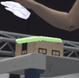

# FAQ

QUESTION: **Why do groundtruth hands not have complete overlap with the image in the visualization (see below) via `scripts_method/train.py`?**
ANSWER: Like most hand-object reconstruction methods, ArcticNet does not assume camera intrinsics and we use a weak perspective camera model by assuming a fixed focal length. The mismatch of 2D alignment between the groundtruth and the image is caused by the weak perspective camera intrinsics.


<p align="center">
  
</p>

QUESTION: **Why is there more misalignment in egocentric view?**
ANSWER: Mainly caused by image distortion in the rendering as the 3D geometry is close to the camera. We estimated distortion parameters from camera calibration sequences, which can be used to apply distortion effect on the meshes with ["vertex displacement for distortion correction"](https://stackoverflow.com/questions/44489686/camera-lens-distortion-in-opengl).

See the `--distort` flag for details:

```python
python scripts_data/visualizer.py --seq_p ./outputs/processed_verts/seqs/s01/capsulemachine_use_01.npy --object --mano --view_idx 0 --distort
```

QUESTION: **Assertion error related to 21 joints**
ANSWER: This is because smplx gives 16 joints for the MANO hand by default. See [setup instruction](setup.md) to allow 21 joints.


QUESTION: **How's 2D space, 3D camera space, 3D world space are related? How about cropping?**
ANSWER: See [here](https://github.com/zc-alexfan/arctic/issues/29#issuecomment-1751657365)
