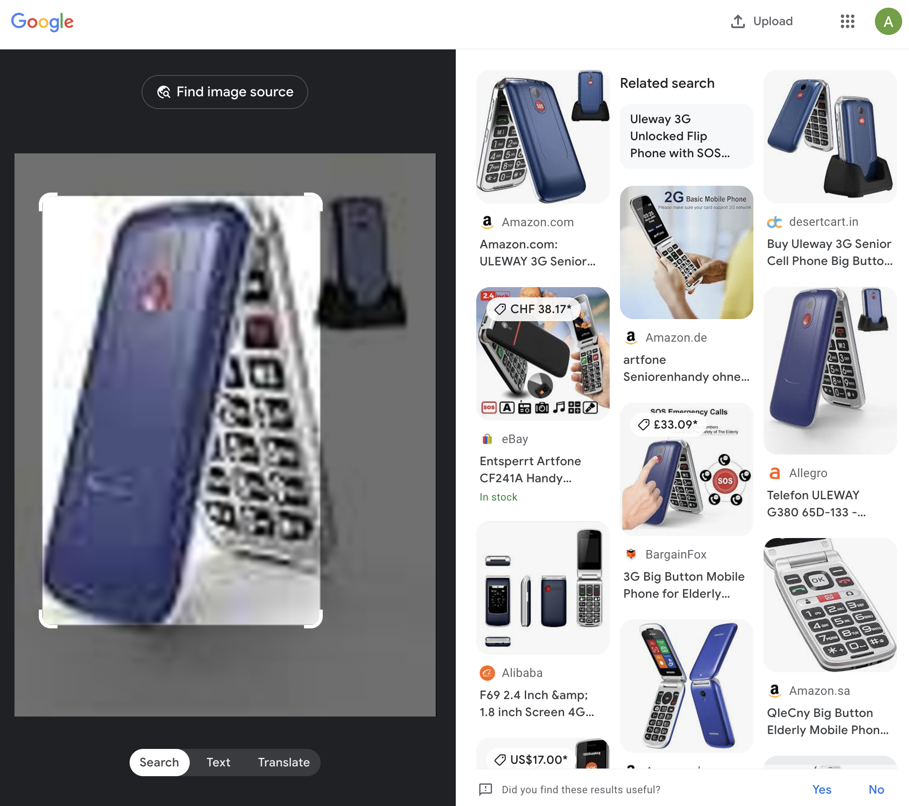

# Guide to purchase ARCTIC objects

Here are a list of links that I used to purchase the ARCTIC objects:

- [Small Foot Toy Kitchen Set](https://www.amazon.de/-/en/dp/B0756C59FR?ref=ppx_yo2ov_dt_b_fed_asin_title&th=1)
- [Titanium Scissors, Non-Stick, 205 mm, SB, Black](https://www.amazon.de/-/en/dp/B00P1F7QVU?ref=ppx_yo2ov_dt_b_fed_asin_title&th=1)
- [Xucker Tomato Ketchup with Xylitol, No Added Sugar: 1 x 500 ml - GMO Free, Vegan](https://www.amazon.de/dp/B07YQ987P4?ref=ppx_yo2ov_dt_b_fed_asin_title)
- [Small Foot Toy Kitchen Set](https://www.amazon.de/dp/B08HK7ZDYL?ref=ppx_yo2ov_dt_b_fed_asin_title&th=1)
- [Autorenplaner | Buch schreiben und veröffentlichen | Handbuch für Autoren & Schriftsteller | Buch schreiben lernen | mit vielen Tipps & Checklisten | für Anfänger geeignet: Der All-in-one Planer](https://www.amazon.de/dp/3966985934?ref=ppx_yo2ov_dt_b_fed_asin_title)
- [Eichhorn 100002575 Wooden Laptop with Puzzle, 14 Pieces, Screen Surface for Writing on with Chalk, Keyboard Consisting of 6 Puzzle Pieces, 32 x 20 cm, Includes 6 Chalks and Sponge](https://www.amazon.de/dp/B00BLEG3SW?ref=ppx_yo2ov_dt_b_fed_asin_title)
- [Creative Deco A4 Wooden Box with Lid | 33.8 x 24.8 x 10 cm (+/- 1 cm) | Unfinished Storage Box | Large Box | Large Wooden Box Ideal for Storing Valuables, Toys and Tools](https://www.amazon.de/dp/B075X4YHZB?ref=ppx_yo2ov_dt_b_fed_asin_title&th=1)
- [Baby Lips Balm Crayon](https://www.amazon.de/dp/B006PG68EU?ref=ppx_yo2ov_dt_b_fed_asin_title&th=1)

Unfortunatley, links for other objects do not work anymore. However, you can find the stock photos of the objects [here](stock_photos/). Using these photos, you can then use Google Image Search to find other vendors selling the same items. For example, 

    

